```mermaid
erDiagram
    ORGANIZATIONS ||--o{ ORGANIZATION_MEMBERS : has
    USERS ||--o{ ORGANIZATION_MEMBERS : belongs_to

    ORGANIZATIONS ||--o{ ORGANIZATION_INVITES : has
    USERS ||--o{ ORGANIZATION_INVITES : sends

    ORGANIZATIONS ||--o{ COMPANIES : owns
    COMPANIES ||--o{ CONTACTS : has

    COMPANIES ||--o{ QUOTES : receives
    CONTACTS ||--o{ QUOTES : recipient
    USERS ||--o{ QUOTES : creates
    QUOTES ||--o{ QUOTE_ITEMS : contains

    QUOTES ||--o| INVOICES : generates
    COMPANIES ||--o{ INVOICES : receives
    CONTACTS ||--o{ INVOICES : recipient
    USERS ||--o{ INVOICES : creates
    INVOICES ||--o{ INVOICE_ITEMS : contains
    INVOICES ||--o{ PAYMENTS : has

    USERS ||--o{ PAYMENTS : creates

    USERS ||--o{ NOTES : writes
    NOTES ||--o{ NOTE_LINKS : has

    ORGANIZATIONS {
        string id PK "cuid"

        string name
        string legal_name

        string siren
        string siret
        string vat_number

        string billing_street
        string billing_city
        string billing_zip_code
        string billing_country "default: FR"

        string email
        string phone
        string website

        enum status "active | archived"

        datetime archived_at
        string archived_by FK "users.id cuid nullable"

        datetime created_at
        datetime updated_at
    }

    USERS {
        string id PK "cuid"

        string email UK
        string password_hash

        string first_name
        string last_name
        string phone

        enum status "active | disabled"

        datetime disabled_at

        datetime created_at
        datetime updated_at
    }

    ORGANIZATION_MEMBERS {
        string id PK "cuid"

        string organization_id FK "cuid"
        string user_id FK "cuid"

        enum role "owner | admin | member"
        enum status "active | removed"

        datetime removed_at
        string removed_by FK "users.id cuid nullable"

        datetime created_at
        datetime updated_at
    }

    ORGANIZATION_INVITES {
        string id PK "cuid"

        string organization_id FK "cuid"
        string email

        enum role "owner | admin | member"
        enum status "pending | accepted | revoked | expired"

        string token_hash

        string invited_by FK "users.id cuid"

        datetime expires_at
        datetime accepted_at
        datetime revoked_at

        datetime created_at
        datetime updated_at
    }

    COMPANIES {
        string id PK "cuid"
        string organization_id FK "cuid"

        string name

        string siren
        string siret
        string vat_number

        string industry
        string website

        string billing_street
        string billing_city
        string billing_zip_code
        string billing_country "default: FR"

        enum status "prospect | customer | archived"

        datetime archived_at
        string archived_by FK "users.id cuid nullable"

        datetime created_at
        datetime updated_at
    }

    CONTACTS {
        string id PK "cuid"

        string organization_id FK "cuid"
        string company_id FK "cuid"

        string first_name
        string last_name
        string email
        string phone
        string job_title

        enum status "active | archived"

        datetime archived_at
        string archived_by FK "users.id cuid nullable"

        datetime created_at
        datetime updated_at
    }

    QUOTES {
        string id PK "cuid"
        string organization_id FK "cuid"

        string quote_number UK "unique per organization"

        date issue_date
        date valid_until

        enum status "draft | sent | accepted | refused | expired | cancelled"

        string company_id FK "cuid"
        string contact_id FK "cuid nullable"
        string created_by FK "users.id cuid"

        jsonb client_snapshot
        jsonb issuer_snapshot

        int subtotal_ht_cents
        int tax_amount_cents
        int total_ttc_cents

        datetime sent_at
        datetime accepted_at
        datetime refused_at
        datetime expired_at
        datetime cancelled_at

        string cancelled_by FK "users.id cuid nullable"

        datetime created_at
        datetime updated_at
    }

    QUOTE_ITEMS {
        string id PK "cuid"

        string organization_id FK "cuid"
        string quote_id FK "cuid"

        string description

        int quantity
        int unit_price_ht_cents

        int tax_rate_basis_points

        int line_subtotal_ht_cents
        int line_tax_amount_cents
        int line_total_ttc_cents

        int position

        datetime created_at
        datetime updated_at
    }

    INVOICES {
        string id PK "cuid"
        string organization_id FK "cuid"

        string invoice_number UK "unique per organization"

        date issue_date
        date due_date
        date service_date

        enum status "to_send | sent | partially_paid | paid | overdue | cancelled"

        string company_id FK "cuid"
        string contact_id FK "cuid nullable"
        string quote_id FK "cuid unique nullable"
        string created_by FK "users.id cuid"

        jsonb client_snapshot
        jsonb issuer_snapshot

        int subtotal_ht_cents
        int tax_amount_cents
        int total_ttc_cents
        int paid_amount_cents

        string payment_terms
        decimal late_penalty_rate
        int recovery_fee_cents

        datetime sent_at
        datetime paid_at
        datetime cancelled_at

        string cancelled_by FK "users.id cuid nullable"

        datetime created_at
        datetime updated_at
    }

    INVOICE_ITEMS {
        string id PK "cuid"

        string organization_id FK "cuid"
        string invoice_id FK "cuid"

        string description

        int quantity
        int unit_price_ht_cents

        int tax_rate_basis_points

        int line_subtotal_ht_cents
        int line_tax_amount_cents
        int line_total_ttc_cents

        int position

        datetime created_at
        datetime updated_at
    }

    PAYMENTS {
        string id PK "cuid"

        string organization_id FK "cuid"
        string invoice_id FK "cuid"

        int amount_cents
        date payment_date

        enum method "bank_transfer | card | cash | cheque | other"
        enum status "recorded | cancelled"

        string reference

        string created_by FK "users.id cuid"

        datetime cancelled_at
        string cancelled_by FK "users.id cuid nullable"

        datetime created_at
        datetime updated_at
    }

    NOTES {
        string id PK "cuid"

        string organization_id FK "cuid"

        text content

        string created_by FK "users.id cuid"

        datetime created_at
        datetime updated_at
    }

    NOTE_LINKS {
        string id PK "cuid"

        string organization_id FK "cuid"
        string note_id FK "cuid"

        enum target_type "company | contact | quote | invoice"
        string target_id "cuid polymorphic"

        datetime created_at
    }
```

---

src/
  app.ts
  server.ts

  config/
    env.ts
    cors.ts

  db/
    client.ts

    schema/
      index.ts
      enums.ts

      organizations.schema.ts
      users.schema.ts
      organization-members.schema.ts
      organization-invites.schema.ts

      companies.schema.ts
      contacts.schema.ts

      quotes.schema.ts
      quote-items.schema.ts

      invoices.schema.ts
      invoice-items.schema.ts
      payments.schema.ts

      notes.schema.ts
      note-links.schema.ts

    migrations/

  routes/
    index.routes.ts

    auth.routes.ts
    organizations.routes.ts
    organization-invites.routes.ts

    companies.routes.ts
    contacts.routes.ts

    quotes.routes.ts
    quote-items.routes.ts

    invoices.routes.ts
    invoice-items.routes.ts
    payments.routes.ts

    notes.routes.ts

  controllers/
    auth.controller.ts
    organizations.controller.ts
    organization-invites.controller.ts

    companies.controller.ts
    contacts.controller.ts

    quotes.controller.ts
    quote-items.controller.ts

    invoices.controller.ts
    invoice-items.controller.ts
    payments.controller.ts

    notes.controller.ts

  services/
    auth.service.ts
    organizations.service.ts
    organization-invites.service.ts

    companies.service.ts
    contacts.service.ts

    quotes.service.ts
    quote-items.service.ts

    invoices.service.ts
    invoice-items.service.ts
    payments.service.ts

    notes.service.ts

    pdf.service.ts
    quote-pdf.service.ts
    invoice-pdf.service.ts

    mail.service.ts
    mail-templates.service.ts

    jwt.service.ts
    password.service.ts

  repositories/
    users.repository.ts
    organizations.repository.ts
    organization-members.repository.ts
    organization-invites.repository.ts

    companies.repository.ts
    contacts.repository.ts

    quotes.repository.ts
    quote-items.repository.ts

    invoices.repository.ts
    invoice-items.repository.ts
    payments.repository.ts

    notes.repository.ts
    note-links.repository.ts

  validators/
    auth.validators.ts
    organizations.validators.ts
    organization-invites.validators.ts

    companies.validators.ts
    contacts.validators.ts

    quotes.validators.ts
    quote-items.validators.ts

    invoices.validators.ts
    payments.validators.ts

    notes.validators.ts

  middlewares/
    auth.middleware.ts
    organization-access.middleware.ts
    role.middleware.ts
    validate.middleware.ts
    error.middleware.ts

  errors/
    app-error.ts

  utils/
    cuid.ts
    money.ts
    dates.ts
    snapshots.ts
    pagination.ts/
    
  tests/
    setup.ts

    fixtures/
        users.fixture.ts
        organizations.fixture.ts
        organization-members.fixture.ts
        organization-invites.fixture.ts

        companies.fixture.ts
        contacts.fixture.ts

        quotes.fixture.ts
        quote-items.fixture.ts

        invoices.fixture.ts
        invoice-items.fixture.ts
        payments.fixture.ts

        notes.fixture.ts
        note-links.fixture.ts

    mocks/
        db.mock.ts
        jwt.service.mock.ts
        password.service.mock.ts
        mail.service.mock.ts
        pdf.service.mock.ts

    repositories/
        users.repository.mock.ts
        organizations.repository.mock.ts
        organization-members.repository.mock.ts
        organization-invites.repository.mock.ts

        companies.repository.mock.ts
        contacts.repository.mock.ts

        quotes.repository.mock.ts
        quote-items.repository.mock.ts

        invoices.repository.mock.ts
        invoice-items.repository.mock.ts
        payments.repository.mock.ts

        notes.repository.mock.ts
        note-links.repository.mock.ts

    unit/
        utils/
        money.test.ts
        dates.test.ts
        snapshots.test.ts
        pagination.test.ts

        services/
        auth.service.test.ts
        organizations.service.test.ts
        organization-invites.service.test.ts

        companies.service.test.ts
        contacts.service.test.ts

        quotes.service.test.ts
        quote-items.service.test.ts

        invoices.service.test.ts
        invoice-items.service.test.ts
        payments.service.test.ts

        notes.service.test.ts

    integration/
        repositories/
        users.repository.test.ts
        organizations.repository.test.ts
        organization-members.repository.test.ts
        organization-invites.repository.test.ts

        companies.repository.test.ts
        contacts.repository.test.ts

        quotes.repository.test.ts
        quote-items.repository.test.ts

        invoices.repository.test.ts
        invoice-items.repository.test.ts
        payments.repository.test.ts

        notes.repository.test.ts
        note-links.repository.test.ts

    e2e/
        auth.e2e.test.ts
        organizations.e2e.test.ts
        organization-invites.e2e.test.ts

        companies.e2e.test.ts
        contacts.e2e.test.ts

        quotes.e2e.test.ts
        quote-items.e2e.test.ts

        invoices.e2e.test.ts
        invoice-items.e2e.test.ts
        payments.e2e.test.ts

        notes.e2e.test.ts
    ---

---

# CLAUDE.md — MyDash Backend

## Project Overview

MyDash is a backend API for freelancers and small businesses.

The application manages:

- organizations
- users and organization members
- organization invitations
- companies
- contacts
- quotes
- invoices
- invoice payments
- notes linked to business entities

Main business flow:

```txt
Company / Contact
  → Quote
  → Quote accepted
  → Invoice generated
  → Invoice sent
  → Payment recorded
````

The backend must use a classic MVC architecture.

---

## Tech Stack

Use the following stack:

```txt
Language: TypeScript
Runtime: Node.js
HTTP framework: Express
ORM: Drizzle ORM
Database: PostgreSQL
Authentication: JWT
Validation: Zod
PDF generation: PDFKit
Testing: Vitest
IDs: CUID strings
```

Do not replace the chosen stack unless explicitly asked.

---

## Architecture Rule

This project uses a classic MVC separation.

The main flow must be:

```txt
routes
  → controllers
  → services
  → repositories
  → db/schema
  → PostgreSQL
```

Responsibilities:

| Layer           | Responsibility                                       |
| --------------- | ---------------------------------------------------- |
| `routes/`       | Declare HTTP endpoints only                          |
| `controllers/`  | Handle `req`, call services, return `res`            |
| `services/`     | Business logic and orchestration                     |
| `repositories/` | Drizzle database queries only                        |
| `db/schema/`    | Drizzle table definitions and inferred types         |
| `validators/`   | Zod request validation schemas                       |
| `middlewares/`  | Auth, organization access, roles, validation, errors |
| `utils/`        | Pure reusable helpers                                |
| `errors/`       | Application error class                              |

Important rules:

* Do not put SQL or Drizzle queries inside controllers.
* Do not put business rules inside repositories.
* Do not put request/response logic inside services.
* Do not create `models/entities`.
* Do not create `modules/` or `features/`.
* Do not create `jobs/` for now.
* Do not create `shared/types/` for now.
* Do not create one error file per error type.
* Use only `errors/app-error.ts`.

---

## Final Folder Structure

Respect this structure:

```txt
src/
  app.ts
  server.ts

  config/
    env.ts
    cors.ts

  db/
    client.ts

    schema/
      index.ts
      enums.ts

      organizations.schema.ts
      users.schema.ts
      organization-members.schema.ts
      organization-invites.schema.ts

      companies.schema.ts
      contacts.schema.ts

      quotes.schema.ts
      quote-items.schema.ts

      invoices.schema.ts
      invoice-items.schema.ts
      payments.schema.ts

      notes.schema.ts
      note-links.schema.ts

    migrations/

  routes/
    index.routes.ts

    auth.routes.ts
    organizations.routes.ts
    organization-invites.routes.ts

    companies.routes.ts
    contacts.routes.ts

    quotes.routes.ts
    quote-items.routes.ts

    invoices.routes.ts
    invoice-items.routes.ts
    payments.routes.ts

    notes.routes.ts

  controllers/
    auth.controller.ts
    organizations.controller.ts
    organization-invites.controller.ts

    companies.controller.ts
    contacts.controller.ts

    quotes.controller.ts
    quote-items.controller.ts

    invoices.controller.ts
    invoice-items.controller.ts
    payments.controller.ts

    notes.controller.ts

  services/
    auth.service.ts
    organizations.service.ts
    organization-invites.service.ts

    companies.service.ts
    contacts.service.ts

    quotes.service.ts
    quote-items.service.ts

    invoices.service.ts
    invoice-items.service.ts
    payments.service.ts

    notes.service.ts

    pdf.service.ts
    quote-pdf.service.ts
    invoice-pdf.service.ts

    mail.service.ts
    mail-templates.service.ts

    jwt.service.ts
    password.service.ts

  repositories/
    users.repository.ts
    organizations.repository.ts
    organization-members.repository.ts
    organization-invites.repository.ts

    companies.repository.ts
    contacts.repository.ts

    quotes.repository.ts
    quote-items.repository.ts

    invoices.repository.ts
    invoice-items.repository.ts
    payments.repository.ts

    notes.repository.ts
    note-links.repository.ts

  validators/
    auth.validators.ts
    organizations.validators.ts
    organization-invites.validators.ts

    companies.validators.ts
    contacts.validators.ts

    quotes.validators.ts
    quote-items.validators.ts

    invoices.validators.ts
    payments.validators.ts

    notes.validators.ts

  middlewares/
    auth.middleware.ts
    organization-access.middleware.ts
    role.middleware.ts
    validate.middleware.ts
    error.middleware.ts

  errors/
    app-error.ts

  utils/
    cuid.ts
    money.ts
    dates.ts
    snapshots.ts
    pagination.ts

tests/
  setup.ts

  fixtures/
    users.fixture.ts
    organizations.fixture.ts
    organization-members.fixture.ts
    organization-invites.fixture.ts

    companies.fixture.ts
    contacts.fixture.ts

    quotes.fixture.ts
    quote-items.fixture.ts

    invoices.fixture.ts
    invoice-items.fixture.ts
    payments.fixture.ts

    notes.fixture.ts
    note-links.fixture.ts

  mocks/
    db.mock.ts
    jwt.service.mock.ts
    password.service.mock.ts
    mail.service.mock.ts
    pdf.service.mock.ts

    repositories/
      users.repository.mock.ts
      organizations.repository.mock.ts
      organization-members.repository.mock.ts
      organization-invites.repository.mock.ts

      companies.repository.mock.ts
      contacts.repository.mock.ts

      quotes.repository.mock.ts
      quote-items.repository.mock.ts

      invoices.repository.mock.ts
      invoice-items.repository.mock.ts
      payments.repository.mock.ts

      notes.repository.mock.ts
      note-links.repository.mock.ts

  unit/
    utils/
      money.test.ts
      dates.test.ts
      snapshots.test.ts
      pagination.test.ts

    services/
      auth.service.test.ts
      organizations.service.test.ts
      organization-invites.service.test.ts

      companies.service.test.ts
      contacts.service.test.ts

      quotes.service.test.ts
      quote-items.service.test.ts

      invoices.service.test.ts
      invoice-items.service.test.ts
      payments.service.test.ts

      notes.service.test.ts

  integration/
    repositories/
      users.repository.test.ts
      organizations.repository.test.ts
      organization-members.repository.test.ts
      organization-invites.repository.test.ts

      companies.repository.test.ts
      contacts.repository.test.ts

      quotes.repository.test.ts
      quote-items.repository.test.ts

      invoices.repository.test.ts
      invoice-items.repository.test.ts
      payments.repository.test.ts

      notes.repository.test.ts
      note-links.repository.test.ts

  e2e/
    auth.e2e.test.ts
    organizations.e2e.test.ts
    organization-invites.e2e.test.ts

    companies.e2e.test.ts
    contacts.e2e.test.ts

    quotes.e2e.test.ts
    quote-items.e2e.test.ts

    invoices.e2e.test.ts
    invoice-items.e2e.test.ts
    payments.e2e.test.ts

    notes.e2e.test.ts
```

---

## Database Rules

Use Drizzle ORM schema files in `src/db/schema`.

All primary keys and foreign keys use CUID strings.

Example:

```txt
id: string
organization_id: string
user_id: string
company_id: string
quote_id: string
invoice_id: string
```

Do not use integer IDs.

Do not create separate entity files. Use Drizzle inferred types:

```ts
export type User = typeof users.$inferSelect;
export type NewUser = typeof users.$inferInsert;
```

---

## Database Tables

The database contains:

```txt
organizations
users
organization_members
organization_invites

companies
contacts

quotes
quote_items

invoices
invoice_items
payments

notes
note_links
```

---

## Enums

Create all enums in:

```txt
src/db/schema/enums.ts
```

Required enums:

```txt
organization_status:
- active
- archived

user_status:
- active
- disabled

organization_member_role:
- owner
- admin
- member

organization_member_status:
- active
- removed

organization_invite_status:
- pending
- accepted
- revoked
- expired

company_status:
- prospect
- customer
- archived

contact_status:
- active
- archived

quote_status:
- draft
- sent
- accepted
- refused
- expired
- cancelled

invoice_status:
- to_send
- sent
- partially_paid
- paid
- overdue
- cancelled

payment_method:
- bank_transfer
- card
- cash
- cheque
- other

payment_status:
- recorded
- cancelled

note_target_type:
- company
- contact
- quote
- invoice
```

---

## Business Rules

### Organizations

Organizations represent the business issuing quotes and invoices.

Organizations are not hard-deleted.

Use:

```txt
status = active | archived
archived_at
archived_by
```

When an organization is archived, it should not appear in normal active lists.

---

### Users

Users are not hard-deleted.

Use:

```txt
status = active | disabled
disabled_at
```

A disabled user cannot authenticate.

---

### Organization Members

A member links a user to an organization.

Roles:

```txt
owner
admin
member
```

Members are not hard-deleted.

Use:

```txt
status = active | removed
removed_at
removed_by
```

Rules:

* `owner` can manage organization settings and members.
* `admin` can manage business data and invites.
* `member` can access business data but should have limited admin permissions.
* A user cannot be added twice as an active member of the same organization.

---

### Organization Invites

Invites allow an owner/admin to invite someone to an organization.

Invite lifecycle:

```txt
pending → accepted
        ↘ revoked
        ↘ expired
```

Rules:

* Store only `token_hash`, never the raw token.
* `invited_by` references the user who sent the invite.
* When an invite is accepted, create an `organization_members` row.
* Do not allow multiple pending invites for the same email in the same organization.

---

### Companies

Companies represent clients or prospects.

Company statuses:

```txt
prospect
customer
archived
```

Rules:

* New companies are `prospect` by default.
* When a quote is accepted, the company becomes `customer`.
* Archived companies are hidden from normal active lists.
* Companies are not hard-deleted.

---

### Contacts

Contacts belong to companies.

Rules:

* A contact belongs to one company.
* A contact belongs to one organization.
* Contacts are not hard-deleted.
* Use `status = active | archived`.

There is no `is_primary` field.

---

### Quotes

Quotes represent commercial proposals.

Quote lifecycle:

```txt
draft → sent → accepted
      ↘ refused
      ↘ expired
      ↘ cancelled
```

Rules:

* Quote items are editable only while the quote is `draft`.
* Once a quote is `sent`, its items should be locked.
* Once a quote is `accepted`, an invoice should be generated.
* A quote should generate at most one invoice.
* A cancelled quote should not generate an invoice.

Quote status meanings:

| Status      | Meaning              |
| ----------- | -------------------- |
| `draft`     | Editable draft       |
| `sent`      | Sent to client       |
| `accepted`  | Accepted by client   |
| `refused`   | Refused by client    |
| `expired`   | Validity date passed |
| `cancelled` | Cancelled internally |

---

### Quote Items

Quote items store quote line details.

Rules:

* VAT is stored per item.
* Prices are stored in cents.
* Do not use floats for money.
* Use `tax_rate_basis_points`.

Examples:

```txt
2000 = 20%
1000 = 10%
550 = 5.5%
0 = 0%
```

Line totals:

```txt
line_subtotal_ht_cents = quantity * unit_price_ht_cents
line_tax_amount_cents = line_subtotal_ht_cents * tax_rate_basis_points / 10000
line_total_ttc_cents = line_subtotal_ht_cents + line_tax_amount_cents
```

---

### Invoices

Invoices represent payment requests.

Invoice lifecycle:

```txt
to_send → sent → paid
        ↘ partially_paid → paid
        ↘ overdue → paid
        ↘ cancelled
```

Rules:

* An invoice may be generated from a quote.
* `quote_id` is nullable in the latest schema, but when present it must be unique.
* Invoice items are cloned from quote items when generated from a quote.
* Invoice items should not be modified after creation.
* Payments update `paid_amount_cents`.
* A fully paid invoice has `status = paid`.
* A partially paid invoice has `status = partially_paid`.
* An unpaid invoice past `due_date` can become `overdue`.
* Cancelled invoices store `cancelled_at` and `cancelled_by`.

Invoice totals are stored on the invoice:

```txt
subtotal_ht_cents
tax_amount_cents
total_ttc_cents
paid_amount_cents
```

VAT rate is not stored globally on the invoice. VAT rates are stored on invoice items.

---

### Invoice Items

Invoice items are the fixed invoice line details.

Rules:

* VAT is stored per item.
* Prices are stored in cents.
* Do not use floats.
* Use `tax_rate_basis_points`.
* Invoice totals are summaries of invoice item totals.

---

### Payments

Payments represent money received for an invoice.

Payment methods:

```txt
bank_transfer
card
cash
cheque
other
```

Payment statuses:

```txt
recorded
cancelled
```

Rules:

* Payments are not hard-deleted.
* Use `status = cancelled` to cancel a payment.
* Cancelled payments should not count in `paid_amount_cents`.
* A payment cannot make the invoice paid amount exceed `total_ttc_cents`.
* After creating or cancelling a payment, recalculate invoice payment status.

Payment status calculation:

```txt
paid_amount_cents = sum(recorded payments)

if paid_amount_cents = 0:
  invoice.status = sent

if paid_amount_cents > 0 and paid_amount_cents < total_ttc_cents:
  invoice.status = partially_paid

if paid_amount_cents = total_ttc_cents:
  invoice.status = paid
  invoice.paid_at = current date
```

---

### Notes

Notes contain free text.

Notes can be linked to multiple entities through `note_links`.

Allowed note targets:

```txt
company
contact
quote
invoice
```

Rules:

* `note_links.target_id` is polymorphic.
* Do not create separate routes/controllers for `note_links`.
* Manage note links through `notes.service.ts`.
* Prevent duplicate links using `(note_id, target_type, target_id)`.

---

## Money Rules

Never use `float` or JavaScript decimal arithmetic for stored money.

Use integer cents:

```txt
1000 cents = 10.00 €
120000 cents = 1200.00 €
```

Use `utils/money.ts` for:

* HT calculation
* TVA calculation
* TTC calculation
* remaining amount calculation
* formatting cents for display
* validating payment amounts

---

## Snapshot Rules

Quotes and invoices use snapshots:

```txt
client_snapshot
issuer_snapshot
```

Purpose:

* keep historical client information
* keep historical issuer information
* avoid old quotes/invoices changing when company or organization data changes

Snapshots should be generated with:

```txt
utils/snapshots.ts
```

When to create snapshots:

* quote sent
* invoice created

Snapshots should include enough data to generate a PDF without depending on future company/organization updates.

---

## PDF Rules

Use PDFKit.

PDF services:

```txt
services/pdf.service.ts
services/quote-pdf.service.ts
services/invoice-pdf.service.ts
```

Responsibilities:

### `pdf.service.ts`

Low-level PDF helpers:

* create document
* draw text
* draw table
* draw totals
* return buffer

### `quote-pdf.service.ts`

Generate quote PDFs.

Input:

```txt
quote
quote_items
client_snapshot
issuer_snapshot
```

Output:

```txt
DEV-YYYY-XXX.pdf
```

### `invoice-pdf.service.ts`

Generate invoice PDFs.

Input:

```txt
invoice
invoice_items
payments
client_snapshot
issuer_snapshot
```

Output:

```txt
FAC-YYYY-XXX.pdf
```

Do not generate PDFs inside controllers.

Controllers call services. Services call PDF services.

---

## Email Rules

Email logic goes in:

```txt
services/mail.service.ts
services/mail-templates.service.ts
```

Responsibilities:

### `mail.service.ts`

Send emails:

* organization invite email
* quote email
* invoice email

### `mail-templates.service.ts`

Generate HTML templates:

* invite email template
* quote email template
* invoice email template

Do not send emails inside controllers directly.

---

## Authentication Rules

Authentication uses JWT.

Services:

```txt
services/jwt.service.ts
services/password.service.ts
```

### `jwt.service.ts`

Responsibilities:

* sign access token
* verify access token
* optionally sign refresh token later

### `password.service.ts`

Responsibilities:

* hash password
* verify password

Controllers must not directly call JWT libraries or password hashing libraries.

---

## Middleware Rules

Required middlewares:

```txt
auth.middleware.ts
organization-access.middleware.ts
role.middleware.ts
validate.middleware.ts
error.middleware.ts
```

### `auth.middleware.ts`

Responsibilities:

* read `Authorization: Bearer <token>`
* verify JWT
* attach user context to request

### `organization-access.middleware.ts`

Responsibilities:

* verify that the authenticated user belongs to the requested organization
* reject with `403` when access is not allowed

### `role.middleware.ts`

Responsibilities:

* restrict sensitive actions to `owner` or `admin`

### `validate.middleware.ts`

Responsibilities:

* validate body, params and query with Zod

### `error.middleware.ts`

Responsibilities:

* convert thrown errors into JSON HTTP responses

---

## Error Handling

Use only:

```txt
errors/app-error.ts
```

Do not create separate error classes unless requested.

Example:

```ts
throw new AppError("Quote not found", 404, "QUOTE_NOT_FOUND");
```

Expected JSON response:

```json
{
  "error": {
    "code": "QUOTE_NOT_FOUND",
    "message": "Quote not found"
  }
}
```

---

## Validation Rules

Use Zod.

Each domain has one validator file:

```txt
auth.validators.ts
organizations.validators.ts
organization-invites.validators.ts
companies.validators.ts
contacts.validators.ts
quotes.validators.ts
quote-items.validators.ts
invoices.validators.ts
payments.validators.ts
notes.validators.ts
```

Validators must be used through `validate.middleware.ts`.

---

## Testing Rules

Use Vitest.

Test folders:

```txt
tests/
  setup.ts
  fixtures/
  mocks/
  unit/
  integration/
  e2e/
```

### Fixtures

Fixtures are stable test data.

Examples:

```txt
users.fixture.ts
organizations.fixture.ts
quotes.fixture.ts
invoices.fixture.ts
```

### Mocks

Mocks replace real dependencies.

Examples:

```txt
mail.service.mock.ts
pdf.service.mock.ts
jwt.service.mock.ts
repositories/*.mock.ts
```

### Unit Tests

Unit tests should test:

* pure utils
* services with mocked repositories
* business rules

Important unit tests:

```txt
money calculations
quote status transitions
invoice status transitions
payment calculations
auth service
organization invite service
```

### Integration Tests

Integration tests should test repositories with a real test database.

Important integration tests:

```txt
users.repository
organizations.repository
quotes.repository
quote-items.repository
invoices.repository
invoice-items.repository
payments.repository
notes.repository
```

### E2E Tests

E2E tests should test full API flows.

Important flows:

```txt
register
login
create organization
invite member
create company
create contact
create quote
add quote items
send quote
accept quote
generate invoice
send invoice
record payment
create note
```

---

## Implementation Order

Implement the backend in this order:

### 1. Project setup

* TypeScript config
* Express app
* environment config
* error middleware
* validation middleware
* Drizzle setup
* database connection

### 2. Database schema

Implement all Drizzle schema files:

* enums
* organizations
* users
* organization members
* organization invites
* companies
* contacts
* quotes
* quote items
* invoices
* invoice items
* payments
* notes
* note links

### 3. Auth and organizations

Implement:

* register
* login
* JWT
* password hashing
* organizations
* organization members
* organization invites
* auth middleware
* role middleware
* organization access middleware

### 4. CRM

Implement:

* companies
* contacts

### 5. Quotes

Implement:

* create quote
* update draft quote
* add quote items
* calculate totals
* send quote
* accept quote
* refuse quote
* cancel quote

### 6. Invoices

Implement:

* create invoice from accepted quote
* clone quote items into invoice items
* generate invoice totals
* send invoice
* generate invoice PDF
* cancel invoice

### 7. Payments

Implement:

* record payment
* cancel payment
* recalculate invoice paid amount
* update invoice payment status

### 8. Notes

Implement:

* create note
* link note to company/contact/quote/invoice
* list notes by target
* update note
* delete note only if allowed by business rules

### 9. Tests

Add tests progressively:

* unit tests first
* then integration tests
* then e2e tests

---

## Non-Negotiable Rules

Do not violate these rules:

```txt
No integer IDs.
No float money fields.
No hard delete for business entities.
No entity.ts files.
No modules/ or features/ folder.
No jobs/ folder for now.
No shared/types/ folder for now.
No multiple custom error files.
No business logic inside controllers.
No Drizzle queries inside controllers.
No PDF generation inside controllers.
No email sending inside controllers.
No VAT rate directly on quotes or invoices.
VAT rate belongs to quote_items and invoice_items.
```

---

## Current Important Detail

There is a typo to avoid in the folder structure:

Wrong:

```txt
pagination.tstests/
```

Correct:

```txt
utils/
  pagination.ts

tests/
  setup.ts
```

---

## Goal

Build a clean, maintainable TypeScript backend for MyDash using:

```txt
classic MVC
Drizzle ORM
PostgreSQL
JWT authentication
PDFKit
Zod validation
Vitest tests
CUID IDs
```

The implementation must remain simple and MVP-friendly while respecting the architecture and business rules above.&