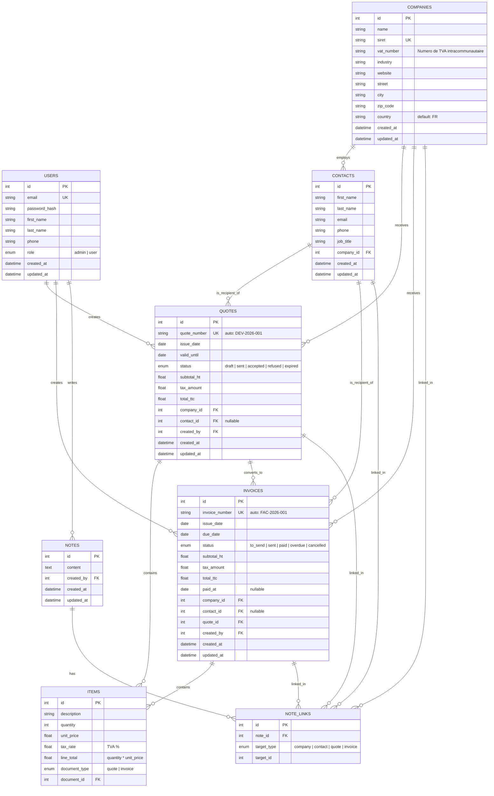

# MyDash - Database Schema

## Overview

Dashboard de gestion pour freelances / petites entreprises. Permet de gerer des contacts, creer des devis, les convertir en factures, et suivre les paiements.

## Diagramme

## Tables

### users

Comptes utilisateur de l'application. Ce sont les personnes qui utilisent le dashboard.

| Colonne | Type | Contrainte | Description |
|---|---|---|---|
| id | int | PK, auto | Identifiant |
| email | string | UK, not null | Email de connexion |
| password_hash | string | not null | Mot de passe hash (bcrypt) |
| first_name | string | not null | Prenom |
| last_name | string | not null | Nom |
| phone | string | nullable | Telephone |
| role | enum | not null, default: user | `admin` ou `user` |
| created_at | datetime | not null | Date de creation |
| updated_at | datetime | not null | Date de mise a jour |

### companies

Repertoire des entreprises (clients / prospects).

| Colonne | Type | Contrainte | Description |
|---|---|---|---|
| id | int | PK, auto | Identifiant |
| name | string | not null | Raison sociale |
| siret | string | UK | SIRET (14 chiffres) |
| vat_number | string | nullable | Numero de TVA intracommunautaire |
| industry | string | nullable | Secteur d'activite |
| website | string | nullable | Site web |
| street | string | nullable | Rue |
| city | string | nullable | Ville |
| zip_code | string | nullable | Code postal |
| country | string | not null, default: FR | Pays |
| created_at | datetime | not null | Date de creation |
| updated_at | datetime | not null | Date de mise a jour |

### contacts

Personnes physiques employees d'une entreprise. Pas de lien avec les users : un contact est une entite CRM pure.

| Colonne | Type | Contrainte | Description |
|---|---|---|---|
| id | int | PK, auto | Identifiant |
| first_name | string | not null | Prenom |
| last_name | string | not null | Nom |
| email | string | nullable | Email professionnel |
| phone | string | nullable | Telephone |
| job_title | string | nullable | Poste (CEO, CTO, etc.) |
| company_id | int | FK companies, not null | Entreprise employeuse |
| created_at | datetime | not null | Date de creation |
| updated_at | datetime | not null | Date de mise a jour |

### quotes

Devis commerciaux envoyes aux entreprises.

| Colonne | Type | Contrainte | Description |
|---|---|---|---|
| id | int | PK, auto | Identifiant |
| quote_number | string | UK, auto | Reference unique (DEV-2026-001) |
| issue_date | date | not null | Date d'emission |
| valid_until | date | not null | Date de validite |
| status | enum | not null, default: draft | `draft` / `sent` / `accepted` / `refused` / `expired` |
| subtotal_ht | float | not null | Total HT (recalcule depuis items) |
| tax_amount | float | not null | Total TVA |
| total_ttc | float | not null | Total TTC |
| company_id | int | FK companies | Entreprise destinataire |
| contact_id | int | FK contacts, nullable | Contact destinataire |
| created_by | int | FK users | Auteur du devis |
| created_at | datetime | not null | Date de creation |
| updated_at | datetime | not null | Date de mise a jour |

**Statuts (enum)** :

| Statut | Description |
|---|---|
| draft | Brouillon, pas encore envoye |
| sent | Envoye au client, en attente de reponse |
| accepted | Client a accepte le devis |
| refused | Client a refuse le devis |
| expired | Devis perime (date depassee sans reponse) |

### invoices

Factures generees automatiquement depuis un devis accepte. Pas de creation directe : toute facture vient d'un devis signe. Creee directement en statut `sent`.

| Colonne | Type | Contrainte | Description |
|---|---|---|---|
| id | int | PK, auto | Identifiant |
| invoice_number | string | UK, auto | Reference unique (FAC-2026-001) |
| issue_date | date | not null | Date d'emission |
| due_date | date | not null | Date d'echeance |
| status | enum | not null, default: to_send | `to_send` / `sent` / `paid` / `overdue` / `cancelled` |
| subtotal_ht | float | not null | Total HT (recalcule depuis items) |
| tax_amount | float | not null | Total TVA |
| total_ttc | float | not null | Total TTC |
| paid_at | date | nullable | Date de paiement effectif |
| company_id | int | FK companies | Entreprise destinataire |
| contact_id | int | FK contacts, nullable | Contact destinataire |
| quote_id | int | FK quotes, not null | Devis source (obligatoire, toute facture vient d'un devis) |
| created_by | int | FK users | Auteur de la facture |
| created_at | datetime | not null | Date de creation |
| updated_at | datetime | not null | Date de mise a jour |

**Statuts (enum)** :

| Statut | Description |
|---|---|
| to_send | Generee depuis un devis, prete a etre envoyee |
| sent | Envoyee au client |
| paid | Payee |
| overdue | En retard de paiement |
| cancelled | Annulee |

### items

Lignes detaillees d'un devis ou d'une facture. Table unique avec propriete polymorphique (`document_type`).

Les items d'un devis sont modifiables uniquement quand le devis est en `draft`. Les items d'une facture sont **toujours verrouilles** (la facture est generee directement en `sent`).

| Colonne | Type | Contrainte | Description |
|---|---|---|---|
| id | int | PK, auto | Identifiant |
| description | string | not null | Description de la prestation |
| quantity | int | not null | Quantite |
| unit_price | float | not null | Prix unitaire HT |
| tax_rate | float | not null | Taux TVA (20.0, 10.0, 5.5...) |
| line_total | float | not null | quantity * unit_price |
| document_type | enum | not null | `quote` ou `invoice` |
| document_id | int | not null | ID du devis ou de la facture parent |

### notes

Notes / commentaires. Le contenu est ici. Les liaisons vers les entites sont dans `note_links`.

| Colonne | Type | Contrainte | Description |
|---|---|---|---|
| id | int | PK, auto | Identifiant |
| content | text | not null | Contenu de la note |
| created_by | int | FK users | Auteur de la note |
| created_at | datetime | not null | Date de creation |
| updated_at | datetime | not null | Date de mise a jour |

### note_links

Table de liaison many-to-many entre une note et les entites. Une note peut etre attachee a plusieurs entites simultanement.

| Colonne | Type | Contrainte | Description |
|---|---|---|---|
| id | int | PK, auto | Identifiant |
| note_id | int | FK notes, not null | Note liee |
| target_type | enum | not null | `company` / `contact` / `quote` / `invoice` |
| target_id | int | not null | ID de l'entite cible |

**Exemple** : une note "RDV tel avec Jean chez Acme suite au devis DEV-001" aurait 3 lignes dans `note_links` :
- `note_id: 1, target_type: "contact", target_id: 42` (Jean)
- `note_id: 1, target_type: "company", target_id: 7` (Acme)
- `note_id: 1, target_type: "quote", target_id: 15` (DEV-001)

## Flow : conversion devis → facture

1. Utilisateur cree un devis avec des items (`document_type: "quote"`) — modifiable tant que `status: "draft"`
2. Devis envoye au client (`status: "sent"`) → items figes
3. Client accepte (`status: "accepted"`)
4. Generation automatique de la facture :
   - Creation d'une `invoice` avec `quote_id` pointant vers le devis, `status: "to_send"` (prete a envoyer)
   - **Clonage** de tous les items du devis avec `document_type: "invoice"`, `document_id: id_nouvelle_facture`
   - Les items du devis restent intacts pour historique
   - Les items de la facture sont **verrouilles** (aucune modification possible)
5. Utilisateur envoie la facture (`to_send` → `sent`)
6. Suivi : `sent` → `paid` (ou `overdue` si date depassee)

## 7 tables

| Table | Role |
|---|---|
| `users` | Authentification et autorisation |
| `companies` | Repertoire des entreprises |
| `contacts` | Personnes liees aux entreprises (CRM) |
| `quotes` | Devis commerciaux |
| `invoices` | Factures |
| `items` | Lignes de devis ou factures (polymorphique) |
| `notes` + `note_links` | Notes attachees a une ou plusieurs entites |
